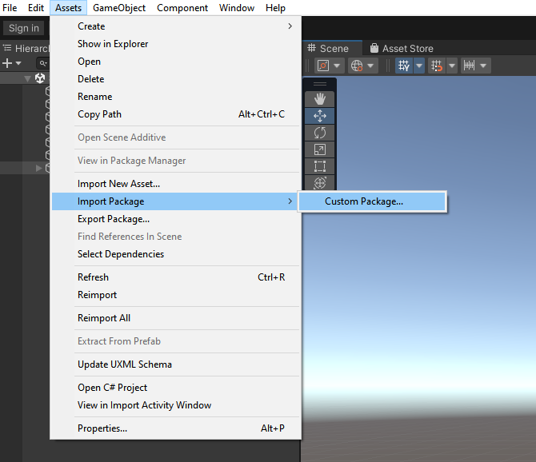
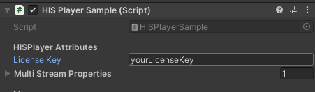
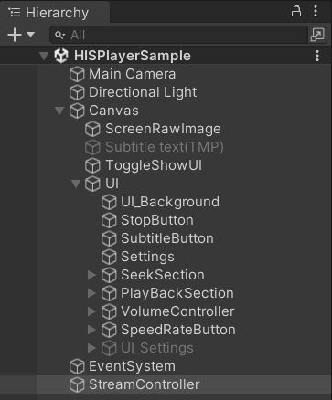

# 360 Video on Android devices
It is possible to integrate HISPlayer SDK with 360 videos in mobile devices. In the case of using Oculus devices, please refer to this section
[**Oculus Set Up Guide**](https://hisplayer.github.io/UnityAndroid-SDK/#/oculus) before continuing with this guide.

Please, download the sample here -> [**HISPlayer Android 360 Sample**](TODO:ADD_THE_URL_HERE) (no need to download it if you have received it in the email).

## Import HISPlayer Sample
Importing the package is the same as importing other normal packages in Unity. Select the downloaded package and import it.

- **Assets > Import Package > Custom Package > HISPlayer_Android_360_Sample.unitypackage**

- Complete the configuration for Android ->  [**Configure Unity for Android**](./setup-guide.md#12-configure-unity-for-android)

- Open the scene **Assets/HISPlayerSample/Scenes/HISPlayer360Sample.unity**

- Import TextMesh Pro Essential

- Input the license key through the Inspector Window. **StreamController** game object -> **HISPlayerSample** component -> **License Key**

- Open **File** > **Build Settings** > **Add Open Scenes**

- Build and Run

To check how to set up the SDK and API usage, please refer to **Assets/HISPlayerSample/Scripts/HISPlayerSample.cs** and **StreamController GameObject** in the Editor.

## UI Demo
The UI components in the sample scene are fully modifiable. The sample is intended to show a comprehensive scene using the HISPlayer SDK to help demonstrate features
such as play, pause, seek, etc.

### How to display a 360 video
To display a 360 environment, set the Main Camera **Clear Flag** field to **Skybox**.

  

Use a **Render Texture** attach to a **Unity Material** with the shader **Skybox/Panoramic**. You can check: 

- **Assets/HISPlayerSample/Resources/HISPlayer_360_Material.mat**
- **Assets/HISPlayerSample/Resources/HISPlayer_360_RenderTexture.renderTexture**

  
  

Open **Window** > **Rendering** > **Lighting** > **Environment** and attach the **Material** to the **Skybox Material** in the Lighting configuration. 

  

Select **Render Mode** > **Render Texture** and attach the previous **Render Texture** to the **StreamController Render Texture** field

  

### How to use the Android Gyroscope
The Gyroscope is a typical Android sensor used for different cases. We're using the gyroscope to control the camera of the demo. If you are using Oculus devices, 
this step can be skip, since Oculus is controlling the camera by itself.

To check how to use the Gyroscope, please refer to **Assets/HISPlayerSample/Scripts/GyroscopeController.cs** and **Main Camera GameObject** in the Editor. 

