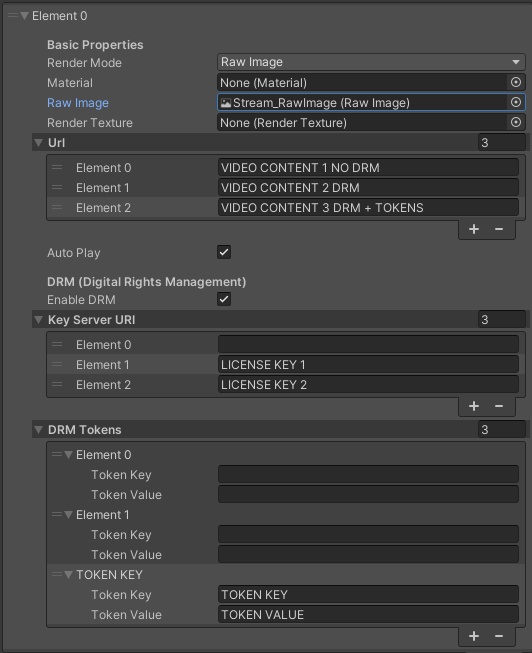

# DRM

In the video streaming industry, the DRM (Digital Rights Management) makes possible a secure distribution of contents over the network.
Encrypted content is prepared using an encryption server and stored in a content library. The encrypted content is streamed or downloaded from the content library to client devices via content servers. Licenses to view the content are obtained from the License Server.

The HISPlayer Unity Video Player SDK for Android provides an API to the users for usage of the MediaDRM module.

Use **Multi Stream Properties** to set the DRM fields. It is possible to add license keys both in the editor and from code (see AddStream and AddVideoContent in [HISPlayer API](/hisplayer-api.md) for more details):

* <ins>**Enable DRM**</ins>: Check to enable DRM usage. When enabled, there should be one license key URI per content URL even though the content is clear (empty license key URI). This field will have effect during the AddVideoContent functionality.
* <ins>**Key Server URI**</ins>: Add license URLs for DRM-protected contents. There must be one license key URL per content URL when the “Enable DRM” is checked.
* <ins>**DRM Headers**</ins>: If your key server needs more information, add drm headers for DRM-protected contents alongside the respective Key Server URI. There must be one token per key server uri when the “Enable DRM” is checked. The headers are composed of a Key and a Value. This field will have effect during the AddVideoContent functionality.

The below image shows an example of the usage of the DRM fields in the editor:
* There are 3 URLs:
  * VIDEO CONTENT 1 CLEAR
  * VIDEO CONTENT 2 DRM
  * VIDEO CONTENT 3 DRM + HEADERS
* The 'enableDRM' field is checked.
* There are 3 elements in Key Server URI list:
  * The first one is empty, because the first content is clear
  * The second and the third elements have their respective license key
* There are 3 elements in DRM Tokens list:
  * The first and the second elements are empty because URLs don't require DRM headers.
  * The third element is protected both with a license key and header.

