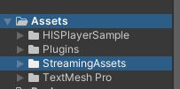
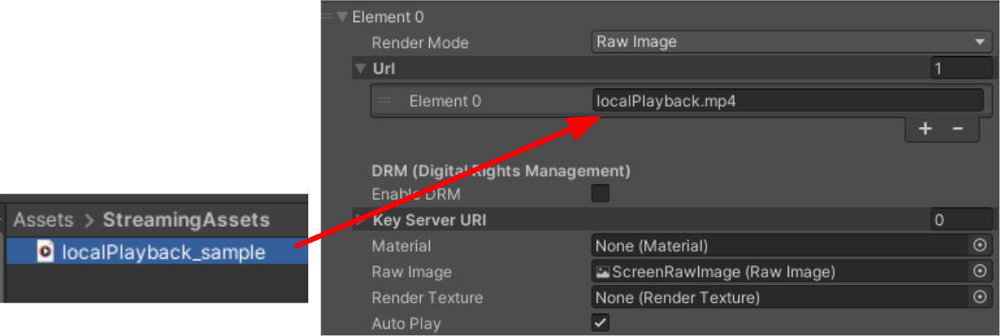
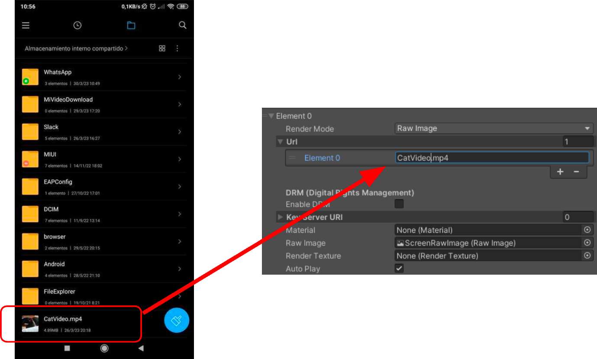

# Playing Local Files

HISPlayer Android for Unity can play local content the device's storage, the [**Unity Streaming Assets**](./local-files.md#Unity-Streaming-Assets) and the [**Unity Persistent Datapath**]()

 

In addition, Android’s devices need permission for using some features such as exploring or using the device’s folders and files. Asking for permissions can be configured following [**Configure Unity for Android**](./setup-guide.md#Configure-Unity-for-Android).

## Unity Streaming Assets
To use this format, it’s necessary to create a new folder into the **Assets** folder of Unity named **StreamingAssets**.

### Video File
Add the video file inside the StreamingAssets folder and pass the file name (**with the extension**) to the **Multi Stream Properties**.
&nbsp;

In case that subfolders are created inside StreamingAssets, the path of the file **must include the subfolder’s name** inside the field of Multi Stream Properties, e.g, with a subfolder named **“MyVideos”** the following path must be used: 

**MyVideos/localPlayback.mp4** 
&nbsp;

### HLS Manifest

Prepare a folder where all the HLS manifest files are stored, including the playlists and the segments. Pass the path of manifest file name with the extension (**.m3u8**) to the **Multi Stream Properties**. You may pass the master playlist or the media playlist. 

  

 

  

If the content is encrypted with AES-128 key, the key file must be stored in the correct location following the `#EXT-X-KEY` tag URI in the manifest file. 

For example below *stream.m3u8* includes the following : `#EXT-X-KEY:METHOD=AES-128,URI="key.bin"`. The key file *key.bin* must exist in the valid path. 

  

## Device’s local videos
In order to add videos from the device, keep in mind the SDK is taking the root path of the phone storage. The next step is to pass the name (**with the extension**) to the Multi Stream Properties.

In the case of exploring subfolders of the devices, it’s enough adding the subfolder at the beginning of the path, e.g., using a **WhatsApp video** it is possible to provide the following path: 

**WhatsApp/Media/WhatsApp Video/video.mp4**
&nbsp;
