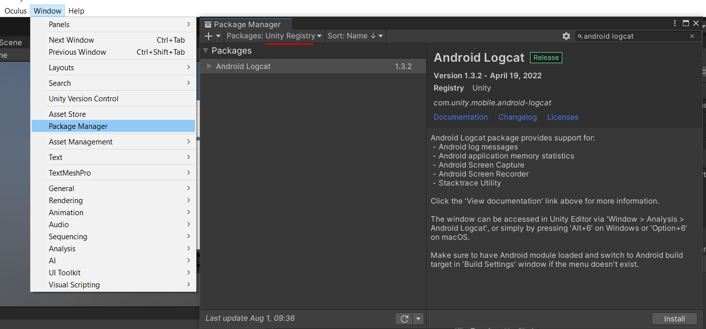
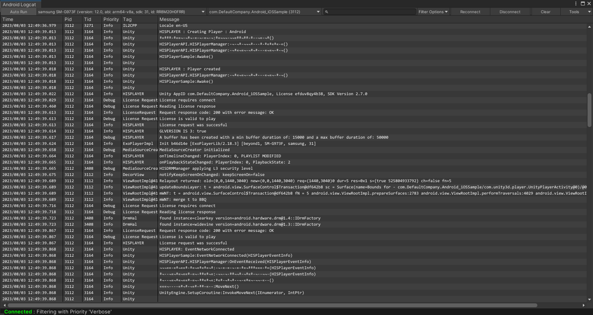
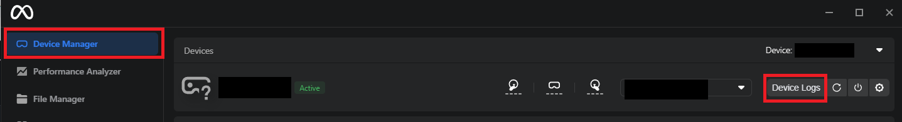
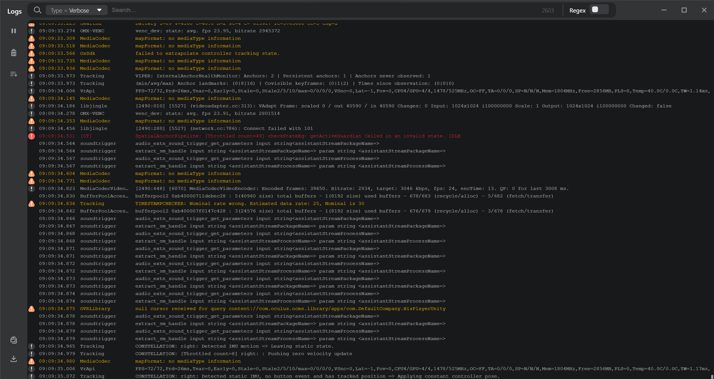

# Obtaining Logs

Through this guide, you will be introduced how to obtain logs which contains warning, error and general information messages. 

## Android Logcat
<a href="https://docs.unity3d.com/Packages/com.unity.mobile.android-logcat@0.1/manual/index.html">Android Logcat Package</a> is a utility for displaying log messages coming from Android device in Unity Editor. 
Android Logcat works for any Android device including Oculus. 

Install Android Logcat from Unity package manager to see all the logs from the Android device.

**Window > Package Manager > Select Packages : Unity Registry > Search Android Logcat > Install**

Android Logcat will be run automatically when you launch the app from Unity.  
Alternatively, you can start it manually : **Window > Analysis > Android Logcat**.

## Oculus Meta Quest Developer Hub
Alternative tool for Oculus is to use <a href="https://developer.oculus.com/documentation/unity/ts-odh/">Meta Quest Developer Hub</a>. 

**Meta Quest Developer Hub > Device Manager > Device Logs**

