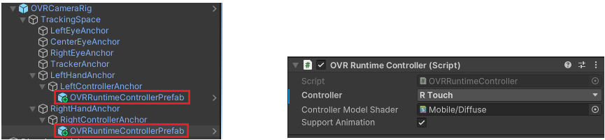

# Oculus Set Up Guide
It is possible to integrate HISPlayer SDK with the Oculus environment.
First, please configure the Unity project for Oculus by following this [Tutorial](https://developer.oculus.com/documentation/unity/unity-tutorial-hello-vr/). 

## Requirements

It's necessary to install the [Oculus XRPlugin](https://developer.oculus.com/documentation/unity/unity-xr-plugin/) and 
import the [OculusIntegration.unitypackage](https://developer.oculus.com/downloads/package/unity-integration/). 

- **Assets > Import Package > Custom Package > OculusIntegration.unitypackage**

#### Supported Android Version
- Minor version - Android 10.0 ‘Quince Tart’
- Minimum SDK: 29

#### Supported Unity Color Space
- Linear

#### Target Architecture
- IL2CPP - ARM64

#### Oculus platform
In XR Plug-in Management, please make sure that you have the **Oculus** option checked. Otherwise, when you run the application, it will show a 2D window without XR environment.
  
  - **Edit > Project Settings > XR Plug-in Management**

#### OpenGLES3 and OVRRuntimeController Compatibility
OpenGLES3 graphics API is required in order to render video. If you use **OVRRuntimeController** in your project, you need to change the **Controller Model Shader** from **Mobile/Diffuse** to other shader.
Click on the right circle next to Mobile/Diffuse, you will get an entire list of all the shaders available.

We recommend to use **MixedReality/FatFingers** shader.

## Import HISPlayer SDK
If you have not imported HISPlayer SDK yet, please follow the [Quickstart Guide](./setup-guide.md).
