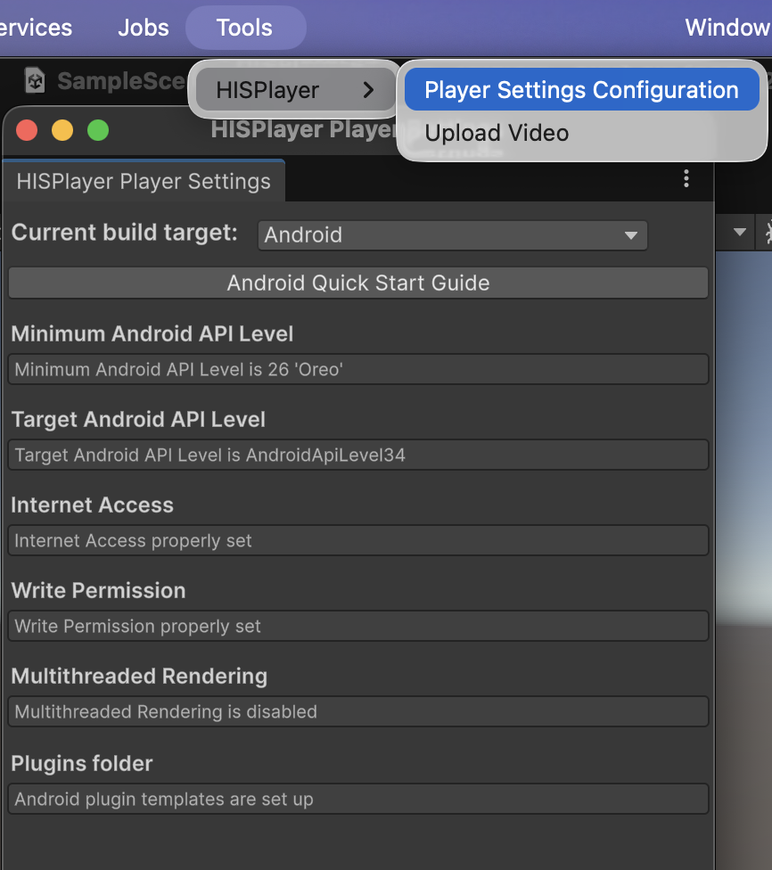
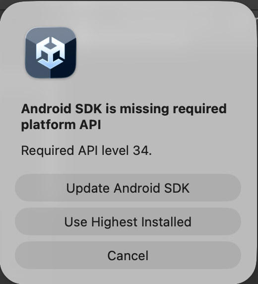
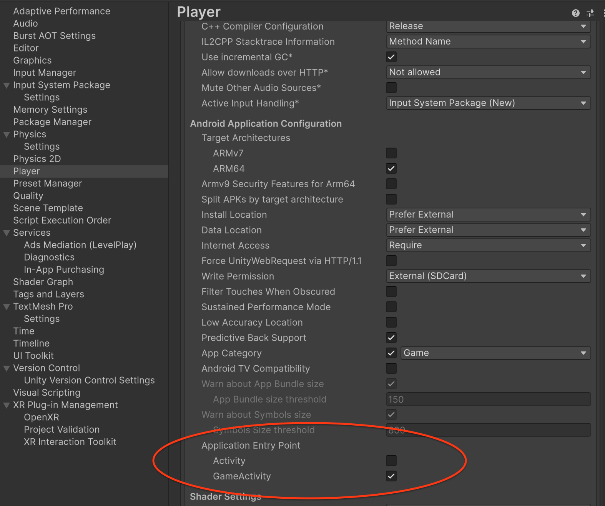

# HISPlayer OpenXR Integration
Getting started with HISPlayer and OpenXR consists of implementing the following steps:

1. Import and configure SDKs

      1.1. Import Unity Packages
 
      1.2. Import HISPlayer SDK
 
      1.3. Configure Unity for Android

      1.4 Configure OpenXR
   
2. HISPlayer OpenXR Sample
   
    2.1 Import HISPlayer OpenXR Sample

## 1.1 Import Unity Packages

You must install a set of specific packages to ensure OpenXR and the VR interactions work correctly.

1. In the top menu bar, go to **Window > Package Manager**.

2. In the Package Manager window, click the dropdown menu in the top-left corner (it usually says Packages: In Project by default) and select **Packages: Unity Registry**.

<p align="center">

</p>

3. Use the search bar that says “Search in Unity Registry” to find and select each of the following packages, then click the **Install** button for each one:
    - XR Interaction Toolkit
    - XR Plugin Management
    - XR Composition Layers
    - OpenXR Plugin

4. Import Starter Assets:
    - In the Package Manager, select the installed **XR Interaction Toolkit** from the list.
    - On the right-side panel, click on the **Samples** tab.
    - Locate **Starter Assets** in the list and click the **Import** button next to it.

<p align="center">

</p>

5. Import TMP Essentials (For UI Text):
    - In the top menu bar, go to **Window > TextMeshPro > Import TMP Essential Resources**.
    - A new pop-up window will appear. Click the **Import** button.

<p align="center">

</p>

## 1.2 Import HISPlayer SDK

Importing the SDK is the same as importing other normal packages in Unity. 
Select the package of _HISPlayer SDK_ and import it.

**Assets > Import Package > Custom Package > HISPlayer SDK unity package**

<p align="center">

</p>

For more details, please refer to the [**Quickstart Guide**](./setup-guide.md).

## 1.3 Configure Unity for Android

Open the window **Tools > HISPlayer** located in the upper side of the screen > Click on Player Settings Configuration > Select **Build Target to Android** > Set all the required settings.

<p align="center">

</p>

Setting **"Plugins folder"** will create **mainTemplate.gradle** and **gradleTemplate.properties** in your ProjectRoot\Assets\Plugins\Android. Please make sure you use the correct **mainTemplate.gradle** that is generated from our SDK. If you need to modify it, please make sure the dependencies and configurations from HISPlayer SDK's mainTemplate.gradle exist in your modified gradle file.

#### Android Target API Level
It is recommended to set Target API Level to 34 or higher. By selecting Android target 34, Unity is going to ask you to update (in the case you don't have the SDK installed). Please, press "Update Android SDK" button.

<p align="center">

</p>

Alternatively, you may set the Target API level to 34 or higher in the Unity project settings.

#### Graphics API
It is recommended to go to **Edit > Project Settings > Player > Android Tab > Other Settings**, disable **Auto Graphics API** and keep **OpenGLES3** only.

For optimized Vulkan support, please check the [**HISPlayer Unity XR SDK**](https://hisplayer.github.io/UnityXR-SDK/#/).

## 1.4 Configure OpenXR

**Application Entry Point Setup**:
1. Go to the top menu bar and click **Edit > Project Settings**.
2. In the left-hand list of the Project Settings window, scroll down and select **Player**.
3. In the main panel, click on the **Android Tab** and open **Other Settings**.
4. In the Android Application Configuration section, make sure Application Entry Point has GameActivity checked and Activity unchecked.

<p align="center">
    
</p>

**XR Plugin Management Setup**:
1. Go to the top menu bar and click **Edit > Project Settings**.
2. In the left-hand list of the Project Settings window, scroll down and select **XR Plug-in Management**.
3. In the main panel, click on the **Android Tab**.
4. Check the box next to **OpenXR** in the Plug-in Providers list.

<p align="center">

</p>

5. If a yellow/red warning triangle appears next to OpenXR, click on the **triangle icon**. A validation window will pop up. Click the **Fix All** button to automatically resolve configuration issues.

**OpenXR Settings**:
1. In the left-hand list of the Project Settings window, click on **OpenXR** (located directly under XR Plug-in Management).

<p align="center">

</p>

2. **Interaction Profiles**:
    - Look for the "Interaction Profiles" section.
    - Click the **"+" (plus)** icon under the list.
    - Select **Khronos Simple Controller Profile**.
    - Click the **"+" (plus)** icon again.
    - Select **Oculus Touch Controller Profile** or other controller profile depending on your VR headsets.

<p align="center">

</p>

3. **OpenXR Feature Groups**:
    - Scroll down to the bottom of the OpenXR settings panel.
    - Check the box for **Meta Quest Support** or other option depending on your VR headset (PICO, etc). 
    - Check the box for **Composition Layer Support**.

## 2.1 Import HISPlayer OpenXR Sample

Please, download the sample here: [**OpenXRSample**](https://downloads.hisplayer.com/Unity/XR/HISPlayer_OpenXR_Sample_2.1.0_AllPlatforms.unitypackage) (no need to download it if you have received it in the email). 

Before using the sample, please make sure you have followed the above steps to set-up your Unity project for OpenXR and HISPlayer SDK. To use the sample, please follow these steps :
  - Configure OpenXR
  - Import HISPlayer SDK
  - Import HISPlayer OpenXR Sample
  - Import TextMeshPro. Go to Unity Window > TextMeshPro > Import TMP Essential Resources
  - Open all Unity scene in Assets/HISPlayerOpenXRSample/Scenes and do the following for each scene:
    - If you received a license key from HISPlayer, input the license key through the Inspector Unity window: **StreamController GameObject > HISPlayerSample component > License Key**
    - Open File > Build Settings > Add Open Scenes
  - Build and Run

To check how to set up the SDK and API usage, please refer to Assets/HISPlayerOpenXRSample/Scripts/Sample/**HISPlayerSample.cs** and **StreamController** GameObject in the Editor.

## Sample Explanation and SDK Usage

### Editor Setup

The **RenderScreen** GameObject displays the video through its **Mesh Renderer**.

All the sample scenes use **RenderTexture** render mode. To check it, go to **StreamController** GameObject > **HISPlayerSample** script > **MultiStreamProperties** > **Element 0** > **RenderMode**. The **RenderTexture** assigned in the **MultiStreamProperties** is used by the material of the **RenderScreen**.

If you use Linear Color Space, please refer to [**Custom Shaders for Linear Color Space**](/shaders.md).

### Scene-Specific Notes

#### SampleList Scene

Select one of the sample scenes described below.

#### HEVC 8K Scene

This scene demonstrates high-resolution video playback using **RenderTexture** render mode.

#### DRM Scene

This scene demonstrates a Widevine DRM protected video playback using **RenderTexture** render mode. For more details about DRM, refer to [**DRM**](/drm.md) page.

#### 360° Scene

This scene demonstrates 360° video playback using **RenderTexture** render mode. The `RenderScreen` GameObject uses a **Sphere** as its Mesh Filter, and its material uses **HISPlayer360Shader** with **Image Type** set to **360 Degrees** and **3D Layout** set to **None**.
<p align="center">
    
</p>

For more details about 360 video playback, refer to [**Custom Shaders for Linear Color Space**](/shaders.md) page.

#### Stereoscopic Scene

This scene demonstrates a Left/Right stereoscopic video playback using **RenderTexture** render mode. The material of the `RenderScreen` GameObject uses **HISPlayerStereoscopicShader** with **3D Layout** set to **Left Right**.
<p align="center">
    
</p>

#### 180 Stereoscopic

This scene demonstrates a 180° Left/Right stereoscopic video playback using **RenderTexture** render mode. The `RenderScreen` GameObject uses a **Sphere** as its Mesh Filter, and its material uses **HISPlayer360Shader** with **Image Type** set to **180 Degrees** and **3D Layout** set to **Side by Side**.
<p align="center">
    
</p>

#### Multistreams

This scene demonstrates the playback of two videos at the same time using **RenderTexture** render mode. Each video is configured as a separate element in **MultiStreamProperties**.

#### MV-HEVC

This scene demonstrates an **MV-HEVC** video playback using **RenderTexture** render mode.

#### Spatial Audio Scene

Two helper GameObjects are present in the scene: **FillAudioSourceGroup** and **GetAudioSourceGroup**. Activating or deactivating them switches between the corresponding audio retrieval APIs.
<p align="center">
    
</p>

For more information, please refer to the following [**Audio Retrieval guide**](/audio-retrieval.md).

### Script

Please check Assets/HISPlayerOpenXRSample/Scripts/Sample/**HISPlayerSample.cs** script. The script must inherit from **HISPlayerManager**. It is necessary to add the **'using HISPlayerAPI;'** dependency

```C#
using System.Collections;
using System.Collections.Generic;
using UnityEngine;
using HISPlayerAPI;

public class HISPlayerSample : HISPlayerManager
{
    ...
}
```

It is necessary to call SetUpPlayer() before calling other APIs. This function initializes everything else that will be needed during the usage of HISPlayer APIs.

## More Information, Features and APIs
For more information about the supported features and APIs, please refer to the following [**HISPlayer API**](/hisplayer-api.md).
