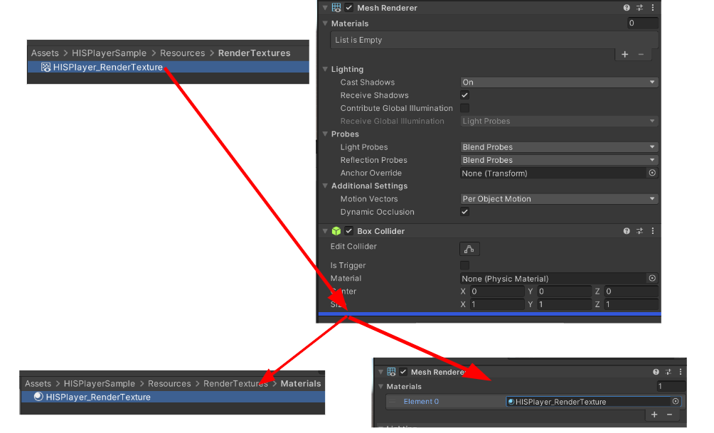
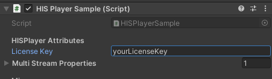

# QuickStart Guide
Getting started with HISPlayer consists of implementing the following steps:

1. Import and configure package   

      1.1. Import package
 
      1.2. Configure Unity for Android
   
2. Create your own sample
   
    2.1 Setup HISPlayer Manager
   
    2.2 Attach Unity Resources
   
    2.3 Configure HISPlayer Properties

    2.4 Build and Run

It's also possible to import the [HISPlayer Sample](/import-sample.md) after completing step 1. The sample is a comprehensive example scene using the HISPlayerSDK to help demonstrate features like play, pause, seek, etc.

## 1.1 Import package

Importing the package is the same as importing other normal packages in Unity. 
Select the package of HISPlayer SDK and import it.

**Assets > Import Package > Custom Package > HISPlayerSDK_Android_iOS unity package**


<p align="center">

</p>

<br>

## 1.2 Configure Unity for Android

Open the window HISPlayer located in the upper side of the screen > Click on Player Settings Configuration > Select Build Target to Android > Set all the required settings.

<p align="center">

</p>

<p align="center">

</p>

By selecting Android target 33, Unity is going to ask you to update (in the case you don't have the SDK 33 installed). Please, press "Update Android SDK" button.

<p align="center">

</p>

## 2.1 Setup HISPlayer Manager

Create a new script which will inherit from **HISPlayerManager**. It is necessary to add the **'using HISPlayerAPI;'** dependancy. Then, add this component to a new game object (recommended to be empty).

Call the **SetUpPlayer()** function in order to initialize the stream environment internally. This function can be called whenever it’s needed.
For example, using the Awake function:

```C#
using System.Collections;
using System.Collections.Generic;
using UnityEngine;
using HISPlayerAPI;

public class HISPlayerAndroidSample : HISPlayerManager
{
    protected override void Awake()
    {
        base.Awake();
        SetUpPlayer();
    }
}
```

It is strictly necessary to use SetUpPlayer before using anything else. This function initializes everything else that will be needed during the usage of HISPlayer APIs. 

Remember to call the Release function after closing the app or before changing scenes in Unity for freeing the internal resources. 

## 2.2 Attach Unity resources

Move to **Unity Editor** to attach all the resources. The rendering system is supporting **Material**, **RawImage** and **RenderTexture** Unity’s components.

### <ins>Material</ins>

Create a new Material from **Assets > Create > Material** and attach it to the GameObject that will be used as screen.


### <ins>Raw Image</ins>

This action will be related to Unity’s Canvas. If there is not a Canvas created yet, creating a Raw Image will create one automatically. 
To create a raw image, select **GameObject > UI > Raw Image**.
Once it is created, it can be associated with the stream controller script without doing anything else (Refer to [**Configure HISPlayer Properties**](./setup-guide.md#Configure-HISPlayer-properties)).

### <ins>RenderTexture</ins>

First of all, check if the Resources folder exists and contains the RenderTextures folder. Another option is creating RenderTexture in Assets directly.
The RenderTexture has to be attached to the GameObject which will be a screen for rendering the multimedia stream. 
For creating this object, select **GameObject > 3D Object > Quad**. Then select the GameObject and remove the material attached to its Mesh Renderer component, then replace it with the RenderTexture created. The RenderTextures folder provided by the SDK contains the Material folder and this material is the one which is needed to be used for the replacement. If the RenderTexture resource has been created from 0, then another option is to grab the RenderTexture from the Assets folder and drop it at the end of the GameObject’s Inspector. This will create a new material automatically.

<p align="center">

</p>

Once all this process it’s done, associate the **RenderTexture** to the script component. 

## 2.3 Configure HISPlayer properties

### <ins>License Key</ins>
Input the license key that is associated with the SDK. If the license key is not valid, the player won't work and will throw an error message.

<p align="center">

</p>

### <ins>Multi Stream Properties</ins>
Use Multi Stream Properties to set all the configuration needed for multi stream (not supported on Windows Editor). It starts with 0 elements. Each element added has its own configuration for multiple players and corresponds to 1 Render Surface. If you just need a single stream, then you just need to add 1 element with 1 URL.

* <span style="color:blue">**Render Mode**</span>: Select the render surface. It can be RenderTexture, Material, RawImage or NONE.
* <span style="color:blue">**Material**</span>: Attach the **Material** asset created to the **Material** section of the element.
* <span style="color:blue">**Raw Image**</span>: Attach the **RawImage** asset created to the **RawImage** section of the element.
* <span style="color:blue">**Render Texture**</span>: Attach the **RenderTexture** to the **RenderTexture** section of the element.
* <span style="color:blue">**URL**</span>: Add the URL associated to the stream. Each stream can have multiple URLs, therefore users can use the same render surface to play different URLs. It is also possible to add local files allocated in the device’s storage and the StreamingAssets special folder of Unity (see [Playing Local Files](/local-files.md) for more details).
* <span style="color:blue">**Autoplay**</span>: Property to determine whether the player will start automatically after set up.
* <span style="color:blue">**Digital Rights Management (DRM)**</span>: The DRM will be disabled by default.  See [DRM](/drm.md) for more details.
<p align="center">

</p>

## Build and Run
Once the configuration it’s done, open 'Build Settings' and press 'Build And Run'.
