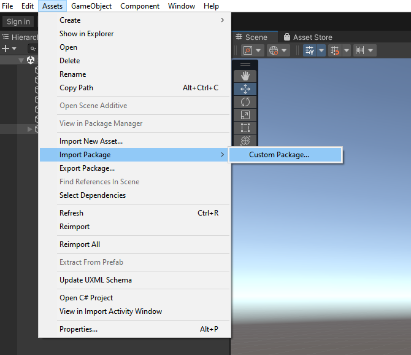

# Setup Guide

Through this guide, you will be introduced to the basic steps for setting up the playback.

## Import package

Importing the package is the same as importing other normal packages in Unity. 
Select the package of HisPlayer SDK and import it.

**Assets > Import Package > Custom Package**

<p align="center">

</p>

<br>

## Configure Unity for Android

Open the window HISPlayer located in the upper side of the screen.


Select Android target (this action will change the target platform for Unity).

<p align="center">

</p>

## Setup HISPlayer Manager

Create a new script which will inherit from **HisPlayerManager**  It is necessary to add the **'using HisPlayerAPI;'** dependancy.
Then, add this component to a new game object (recommended to be empty).

Call the ‘SetUpPlayer()’ function in order to initialize the stream environment internally. This function can be called whenever it’s needed.
For example, using the Awake function:

```C#
using System.Collections;
using System.Collections.Generic;
using UnityEngine;
using HisPlayerAPI;

public class HISPlayerAndroidSample : HisPlayerManager
{
    protected override void Awake()
    {
        base.Awake();
        SetUpPlayer();
    }
}
```
It is strictly necessary to use SetUpPlayer before using anything else. This function initializes everything else that will be needed during the usage of HISPlayer APIs

## Attach Unity resources

Move to **Unity Editor** to attach all the resources. The rendering system is supporting **Material**, **RawImage** and **RenderTexture** Unity’s components.

### <ins>Material</ins>

Create a new Material from **Assets > Create > Material** and attach it to the GameObject that will be used as screen.


### <ins>Raw Image</ins>

This action will be related to Unity’s Canvas. If there is not a Canvas created yet, creating a Raw Image will create one automatically. 
To create a raw image, select **GameObject > UI > Raw Image**.
Once it is created, it can be associated with the stream controller script without doing anything else (Refer to **Configure HisPlayer Properties**).

### <ins>RenderTexture</ins>

First of all, check if the Resources folder exists and contains the RenderTextures folder. Another option is creating RenderTexture in Assets directly.
The RenderTexture has to be attached to the GameObject which will be a screen for rendering the multimedia stream. 
For creating this object, select **GameObject > 3D Object > Quad**. Then select the GameObject and remove the material attached to its Mesh Renderer component, then replace it with the RenderTexture created. The RenderTextures folder provided by the SDK contains the Material folder and this material is the one which is needed to be used for the replacement. If the RenderTexture resource has been created from 0, then another option is to grab the RenderTexture from the Assets folder and drop it at the end of the GameObject’s Inspector. This will create a new material automatically.

<p align="center">

</p>

Once all this process it’s done, associate the **RenderTexture** to the script component. 

## Configure HISPlayer properties

### <ins>License Key</ins>
Input the license key that is associated with the SDK. If the license key is not valid, the player won't work and will throw an error message.

### <ins>Multi Stream Properties</ins>
Use Multi Stream Properties to set all the configuration needed for multi stream (not supported on Windows Editor). It starts with 0 elements. Each element has its own configuration:

* <ins>Render</ins>: Select the render surface. It can be RenderTexture, Material, RawImage or NONE.
* <ins>URL</ins>: Add the URL associated to the stream. Each stream can have multiple URLs, therefore users can use the same render surface to play different URLs. It is also possible to add local files allocated in the device’s storage and the StreamingAssets special folder of Unity (see [Playing Local Files](#Playing Local Files) for more details).
* <ins>Autoplay</ins>: Property to determine whether the player will start automatically after set up.
* <ins>Digital Rights Management (DRM)</ins>: The DRM will be disabled by default.  See [DRM](#DRM) for more details.

## Build and Run
Once the configuration it’s done, open 'Build Settings' and press 'Build And Run'.
