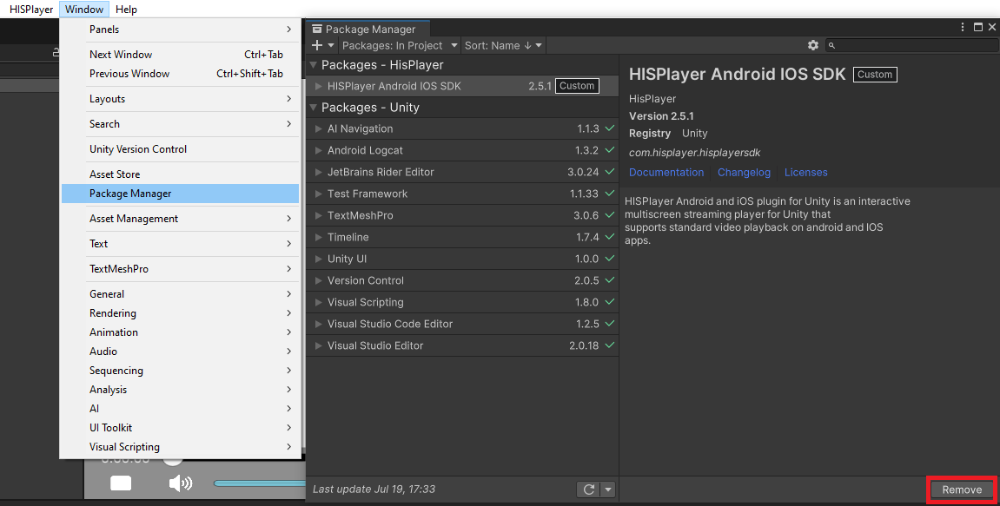
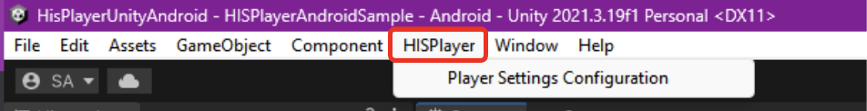

# Update the SDK

Through this guide, you will be introduced how to update the SDK if you already have installed the SDK previously.

## Remove Old Package

Remove the previous HISPlayer Android / iOS SDK package from Unity Package Manager

**Window > Package Manager > Packages - HISPlayer > HISPlayer Android IOS SDK > Remove**

 

## Import New package

Importing the new package is the same as importing other normal packages in Unity. 
Select the package of HISPlayer SDK and import it.

**Assets > Import Package > Custom Package > HISPlayerSDK_Android_iOS unity package**

 

## Configure Unity for Android

Open the window HISPlayer located in the upper side of the screen.

By selecting Android target 33, Unity is going to ask you to update (in the case you don't have the SDK 33 installed). Please, press "Update Android SDK" button.

## Update License Key
Input the license key that is associated with the SDK through HISPlayer properties. If the license key is not valid, the player won't work and will throw an error message.

