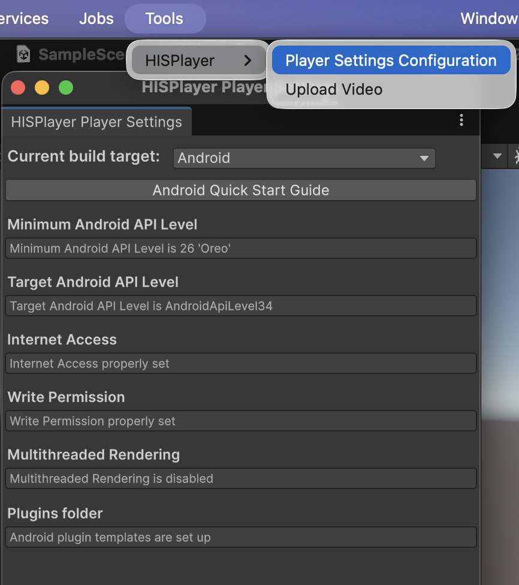
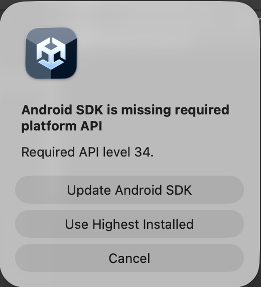

# Update the SDK

Through this guide, you will be introduced how to update the SDK if you already have installed the SDK previously. Please, restart the Editor before continuing.

## Remove Old Package

Remove the previous HISPlayer SDK package from Unity Package Manager.

**Window > Package Manager > Packages - HISPlayer > HISPlayer SDK > Remove**

  

 

## Import New package

Importing the new package is the same as importing other normal packages in Unity. 
Select the package of HISPlayer SDK and import it.

**Assets > Import Package > Custom Package > HISPlayerSDK.unitypackage**

 

## Configure Unity for Android

Open the window **Tools > HISPlayer** located in the upper side of the screen > Click on Player Settings Configuration > Select **Build Target to Android** > Set all the required settings.

It is recommended to set Target API Level to 34 or higher. By selecting Android target 34, Unity is going to ask you to update (in the case you don't have the SDK installed). Please, press "Update Android SDK" button.

Alternatively, you may set the Target API level to 33 or higher in the Unity project settings.

## Update License Key
If you received a license key from HISPlayer, please input the license key in the License Key field.

If the license key is not valid, the player won’t work and will throw an error message. License key is not required for Unity Editor usage.

## Check Material and Shader
After updating the SDK, check whether you have a shader error that is attached to the material. For example as image below:

If you have this issue, please re-attach the correct shader to the material.

